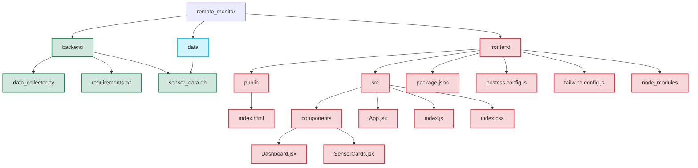

# Purpose of Version: Decoupling data collection fron visualization

1. Separate Data Collection from Visualization
Data Collection Service (Python) → Database → Web Application (Frontend)

2. Time-Series Database Implementation
Postgres and SQlite → Optimized for sensor data storage

3. Data Processing Pipeline
Data Collection → Pre-processing → Aggregation → Storage → API Layer → Client Applications

    Each stage can be independently scaled:

   - Data Collection: Python script communicating with the interrogator
   - Pre-processing: Filtering, validation, unit conversion
   - Aggregation: Downsampling for different time resolutions
   - Storage: Time-series database for persistent storage
   - API Layer: REST or WebSocket interface for clients
   - Client Applications: Web dashboard, mobile app, etc.

4. Lightweight Solution (Python-based)
Python Data Service → Postgres + SQlite DBs → FastAPI → Plotly Dash/React Frontend

# BraggMETER Monitoring System File Structure

